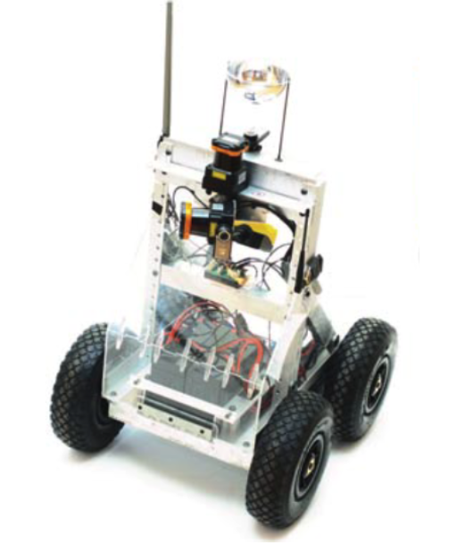

# Projects by Justin Volheim
Each project shown here is linked to its respecitve readme description.

## Robotics 
This folder holds projects related to the atonomus robotics platform shown here.    

- [Visual-Inertial SLAM](https://github.com/jvolheim3/Visual-Inertial-SLAM)   
  This project utilizes camera/IMU data to compute landmarks in a video feed and optimize     
  the location and mapping of the robot over time.

- [LiDAR-Based SLAM](https://github.com/jvolheim3/Lidar-based-slam) :star:  
  This project utilizes lidar, IMU and camera data to compute occupancy grids, localization and mapping of the traversed environment.
  
- [Orientation Tracking](https://github.com/jvolheim3/Orientation_Tracking)   
    This project utilizes IMU data to track the orientation of the robot over time and reconstruct visual data into a panoramic image of the environment.

## Machine Learning

  - Recommender projects
    - [Recipe Recommender:](https://github.com/jvolheim3/Recomender-projects/tree/main/Recipe%20Recommender%20)    
    - [Steam Game Recommender](https://github.com/jvolheim3/Recomender-projects/tree/main/Game%20Recommender)

  - Image Classification and Proccessing 
    - [Least Squares Image Classification](https://github.com/jvolheim3/Image-Classification/tree/main/Least%20Squares%20Image%20Clasification%20)

    - [Gaussian image segmentation](https://github.com/jvolheim3/Image-Classification/tree/main/Guassian_Image_segmentation) :star:

  - Image generation 
    - [Generative Adversarial Networks (GANs)](https://github.com/jvolheim3/image_generation)
    - [Variational Autoencoders (VAEs)](https://github.com/jvolheim3/image_generation)

## Algorithms
  - [Othogonal Matching Pursuit (OMP)](https://github.com/jvolheim3/Othogonal_Matching_Pursuit)
  - [Iterative Closest Point (ICP)](https://github.com/jvolheim3/Iterative-Closest-Point)

## Micro Projects

  - [CV projection matching and classification](https://github.com/jvolheim3/CV-projection-project)